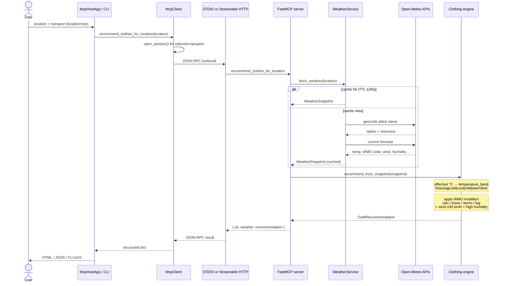

# Clothes Recommend System

Weather-aware clothing recommendations delivered through **FastMCP**.

The system resolves a place name, fetches **today’s live weather**, and returns a structured **outfit recommendation**. MCP Host and Client communicate with MCP servers using **JSON-RPC 2.0** messages over:

1. **Local MCP server** — STDIO transport (`servers/local_stdio/server.py`)  
2. **Remote MCP server** — Streamable HTTP transport (`servers/remote_http/server.py`)

An **MCP Host (Web Client)** inherits the shared `McpClient` class so the browser UI and API reuse the same client logic as the CLI.

---

## Architecture

### System overview

```text
┌─ Entry points ─────────────────────────────────────────────────────────────┐
│  Browser UI / REST API              CLI orchestrator                       │
│  GET /  POST /recommend             python -m clothes_recommend.main       │
│  GET /api/tools  POST /api/recommend   local | remote | both               │
└───────────────┬───────────────────────────────┬────────────────────────────┘
                │                               │
                ▼                               ▼
┌───────────────────────────────┐   ┌───────────────────────────────────────┐
│ MCP Host · McpHostApp         │   │ agent/runner.py                       │
│ host/app.py                   │   │ recommend_via_client(transport, loc)  │
│                               │   └───────────────────┬───────────────────┘
│  inherits ─────────────────┐  │                       │
│                            ▼  │                       │
│               ┌──────────────────────────────┐        │
│               │ McpClient                    │◄───────┘
│               │ clients/mcp_client.py        │
│               │                              │
│               │ 1. select transport          │
│               │ 2. open_session()            │
│               │ 3. tools/list | tools/call   │
│               └──────────────┬───────────────┘
└──────────────────────────────┼────────────────┘
                               │
              FastMCP Client encodes JSON-RPC 2.0
                               │
           ┌───────────────────┴───────────────────┐
           │                                       │
           │ transport="local"                     │ transport="remote"
           │ StdioTransport                        │ StreamableHttpTransport
           │ subprocess stdin/stdout               │ HTTP POST → /mcp
           ▼                                       ▼
┌────────────────────────────┐         ┌────────────────────────────┐
│ Local FastMCP server       │         │ Remote FastMCP server      │
│ clothes-recommend-local    │         │ clothes-recommend-remote   │
│ servers/local_stdio/       │         │ servers/remote_http/       │
│   server.py                │         │   server.py                │
└─────────────┬──────────────┘         └─────────────┬──────────────┘
              │                                      │
              └──────────────────┬───────────────────┘
                                 ▼
              ┌──────────────────────────────────────┐
              │ create_clothes_mcp()                 │
              │ mcp_tools/server_factory.py          │
              │   └── register_clothes_tools(mcp)    │
              │                                      │
              │ Tools (same on both servers):        │
              │  • get_location_weather              │
              │  • recommend_clothes                 │
              │  • recommend_clothes_for_location ★  │
              └──────────────────┬───────────────────┘
                                 ▼
              ┌──────────────────────────────────────┐
              │ Domain services                      │
              │                                      │
              │ WeatherService (domain/weather.py)   │
              │  geocode → forecast → WeatherSnapshot│
              │  (Open-Meteo + 120s cache)           │
              │                                      │
              │ Clothing engine (domain/clothing.py) │
              │  temp band → base outfit             │
              │  + WMO / wind / humidity modifiers   │
              └──────────────────────────────────────┘
```

### Recommendation logic flow

Primary path used by Host and CLI: one MCP round-trip via `recommend_clothes_for_location`.



### Clothing rule logic (server-side)

```text
WeatherSnapshot
       │
       ▼
 effective_temp = apparent_temperature_c ?? temperature_c
       │
       ▼
 temperature_band(effective_temp)
   <0 freezing · <10 cold · <18 cool · <24 mild · <30 warm · else hot
       │
       ▼
 base outfit by band
   (base_layers, outerwear, bottoms, footwear, accessories, avoid)
       │
       ├── WMO rain?   → waterproof shell, umbrella, avoid suede
       ├── WMO snow?   → insulated coat, snow boots, traction
       ├── WMO storm?  → reduce outdoor exposure note
       ├── WMO fog?    → high-visibility layer note
       ├── wind ≥ 30?  → windproof shell
       └── humidity ≥ 80% and warm/hot? → breathable-fabric note
       │
       ▼
 OutfitRecommendation { summary, layers…, notes }
```

Alternate two-step path (when the caller already has weather data):

```text
get_location_weather(location)
        → WeatherSnapshot fields
recommend_clothes(temperature_c, weather_code, …)
        → OutfitRecommendation only
```

### JSON-RPC communication

MCP does not invent a private wire format. Host and servers exchange **JSON-RPC 2.0** request/response objects (for example `tools/list` and `tools/call`). The transport only moves those JSON-RPC frames:

| Transport | How JSON-RPC is carried |
|---|---|
| **STDIO (local)** | JSON-RPC messages on the child process stdin / stdout |
| **Streamable HTTP (remote)** | JSON-RPC messages over HTTP to the MCP endpoint (`/mcp`) |

`McpClient` and `McpHostApp` never hand-craft JSON-RPC packets; FastMCP encodes and decodes them. Inheritance keeps the Host on the same call path as the Client.

| | **Local MCP** | **Remote MCP** |
|---|---|---|
| Framework | FastMCP | FastMCP |
| Transport | STDIO | Streamable HTTP |
| Wire protocol | JSON-RPC 2.0 | JSON-RPC 2.0 |
| Lifecycle | Orchestrator / Host launches and manages the process | Runs as a network service on a configured URL |
| Endpoint | subprocess stdin/stdout | `http://127.0.0.1:8000/mcp` |
| Client helper | `connect_local_mcp()` / `McpClient(transport="local")` | `connect_remote_mcp()` / `McpClient(transport="remote")` |

---

## MCP Host (Web Client)

The Host is a FastAPI web app that **inherits** `McpClient`:

```text
McpHostApp(McpClient)
  └── recommend_clothes_for_location()   # inherited
  └── list_tools() / call_tool()         # inherited
  └── FastAPI routes + HTML UI           # host-only
```

| Path | Role |
|---|---|
| `GET /` | Web UI for location + transport selection |
| `POST /recommend` | Form submit → inherited MCP tool call |
| `GET /api/tools` | List tools from the selected MCP server |
| `POST /api/recommend` | JSON API for the same recommendation flow |
| `GET /api/health` | Host health check |

Source:

- Client class: `src/clothes_recommend/clients/mcp_client.py`
- Host app: `src/clothes_recommend/host/app.py`
- UI template: `src/clothes_recommend/host/templates/index.html`

---

## MCP tools

Both servers register the same tools via `create_clothes_mcp()`:

| Tool | Purpose |
|---|---|
| `get_location_weather` | Geocode a place and return current weather |
| `recommend_clothes` | Outfit from temperature + WMO weather code |
| `recommend_clothes_for_location` | Weather + outfit in one call |

---

## Repository layout

```text
AI-Agents-using-MCP/
├── src/clothes_recommend/
│   ├── domain/                 # weather client, clothing engine
│   ├── mcp_tools/
│   │   ├── server_factory.py   # shared FastMCP server builder
│   │   └── __init__.py         # tool registration
│   ├── clients/
│   │   ├── mcp_client.py       # McpClient class (JSON-RPC via FastMCP)
│   │   ├── stdio_client.py     # local FastMCP Client (STDIO)
│   │   └── http_client.py      # remote FastMCP Client (HTTP)
│   ├── host/
│   │   ├── app.py              # McpHostApp(McpClient) web host
│   │   └── templates/          # browser UI
│   ├── agent/runner.py
│   └── main.py
├── servers/
│   ├── local_stdio/server.py   # FastMCP · STDIO
│   └── remote_http/server.py   # FastMCP · Streamable HTTP
└── examples/
    ├── connect_local.py
    └── connect_remote.py
```

---

## Setup

```bash
git clone https://github.com/sty0331us/AI-Agents-using-MCP.git
cd AI-Agents-using-MCP

python3 -m venv .venv
source .venv/bin/activate

pip install -r requirements.txt
cp .env.example .env
export PYTHONPATH=src
```

Requires **Python 3.10+** and outbound HTTPS access to Open-Meteo.

---

## Run

### MCP Host (Web Client)

```bash
export PYTHONPATH=src
uvicorn clothes_recommend.host.app:app --host 127.0.0.1 --port 8080
```

Open `http://127.0.0.1:8080`. Choose **Local MCP (STDIO)** or **Remote MCP (Streamable HTTP)**.

For remote transport, run the remote server first:

```bash
python servers/remote_http/server.py
```

### CLI · Local MCP (STDIO)

```bash
python -m clothes_recommend.main local --location "Seoul"
```

### CLI · Remote MCP (Streamable HTTP)

```bash
python servers/remote_http/server.py
python -m clothes_recommend.main remote --location "Tokyo"
```

### CLI · Both

```bash
python servers/remote_http/server.py
python -m clothes_recommend.main both --location "London"
```

---

## Client and Host usage

```python
from clothes_recommend.clients import McpClient
from clothes_recommend.host import McpHostApp

# MCP Client — JSON-RPC tool calls over STDIO or Streamable HTTP
client = McpClient(transport="local")
result = await client.recommend_clothes_for_location("Seoul")

# MCP Host — inherits McpClient, adds web routes
host = McpHostApp(transport="local")
# host.app is a FastAPI ASGI application
```

Low-level FastMCP wiring (still JSON-RPC on the wire):

```python
from fastmcp import Client
from fastmcp.client.transports import StdioTransport, StreamableHttpTransport

local = Client(StdioTransport(command="python", args=["servers/local_stdio/server.py"]))
remote = Client(StreamableHttpTransport(url="http://localhost:8000/mcp"))
```

---

## Configuration

| Variable | Description | Default |
|---|---|---|
| `DEFAULT_LOCATION` | Default place for CLI / Host form | `Seoul` |
| `LOCAL_MCP_COMMAND` | Interpreter for the STDIO server | `python` |
| `LOCAL_MCP_ARGS` | Local server script path | `servers/local_stdio/server.py` |
| `REMOTE_MCP_URL` | Remote MCP endpoint | `http://localhost:8000/mcp` |
| `REMOTE_MCP_AUTH_TOKEN` | Optional Bearer token | _(empty)_ |

---

## Design notes

- **JSON-RPC on the wire** — Host/Client ↔ Server messages are JSON-RPC 2.0; STDIO and Streamable HTTP are transports only.
- **Host inherits Client** — `McpHostApp(McpClient)` reuses the same tool methods for UI and API.
- **Two servers** — local STDIO and remote Streamable HTTP; both built with FastMCP and the same tool factory.
- **Structured outputs** — tools return JSON-serializable dicts for agents and the web host.

---

## License

MIT
